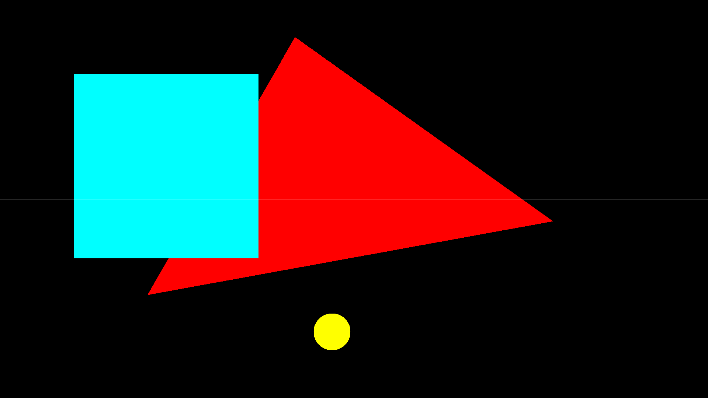

# FrameBuffer Drawing

A small graphics library with direct interacting with the linux framebuffer (`/dev/fbx`)
Temporarily uses `Pillow` to be able to save framebuffer contains.

Might have memory leaks as a bonus!

## Features

- **Framebuffer Manipulation**: Directly interact with the Linux framebuffer to draw shapes and set pixel colors.
- **Drawing Capabilities**: Supports drawing triangles, rectangles, circles, and lines.
- **Screenshot Functionality**: Capture the current framebuffer state and save it as a PNG image.

## Requirements

- Python 3.x
- Root permissions to access the framebuffer device

## Installation

1. Clone the repository:
   ```bash
   git clone https://github.com/Filo6699/framebuffer-drawing
   cd framebuffer-drawing
   ```

2. Make a virtual enviroment (Optional):
   ```bash
   python -m venv venv

   # Linux
   source venv/bin/activate
   
   # ew windows
   .\venv\Scripts\activate
   ```

3. Install the required Python libraries:
   ```bash
   pip install -r requirements.txt
   ```

4. Run the project
   ```bash
   # If you are using a venv
   sudo bash venv_run.sh

   # If you are not using a venv
   sudo main.py
   ```

## Usage

The project includes a `Framebuffer` class for interacting with the framebuffer and a `draw` module for drawing shapes. Below is a simple demo of how to use these components.

### Example

```python
from time import sleep

from framebuffer import Framebuffer
import draw

def run():
    fb = Framebuffer()
    fb.fill((0, 0, 0))  # Fill the screen with black

    p1 = (1500, 600)
    p2 = (400, 800)
    p3 = (800, 100)
    color = (255, 0, 0)  # Red color
    draw.triangle(fb, p1, p2, p3, color)
    draw.rectangle(fb, (200, 200), (700, 700), (0, 255, 255))  # Cyan rectangle
    draw.circle(fb, (900, 900), 50, (255, 255, 0))  # Yellow circle
    draw.line(fb, (0, 1080 // 2), (1919, 1080 // 2), (255, 255, 255))  # White horizontal line

    sleep(5)  # Delay to enjoy the beauty created

    fb.make_screenshot("./screenshot.png")  # Obviosly save it forever

if __name__ == "__main__":
    run()
```

### Output


